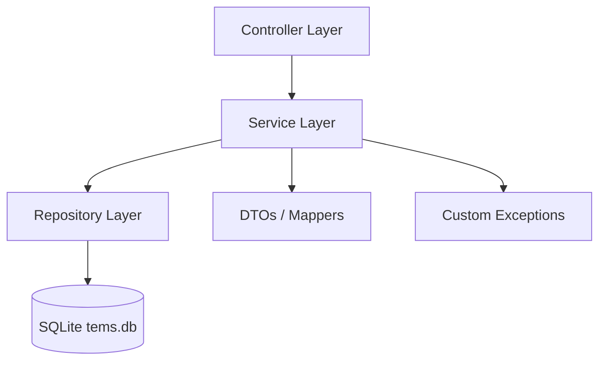

# Transport Enquiry Management System (TEMS)

This repository contains the Java Spring Boot version of TEMS. It is a clean, interview-friendly backend project for searching transport routes, managing bookings, and handling admin operations. It is designed as a realistic campus-placement project using Spring Boot 3, Java 21, SQLite, Spring Data JPA, Swagger, and JUnit 5.

## Features
- User registration and login
- Route search with pagination and sorting
- Route details with ordered stops
- Seat booking and cancellation
- Booking history by user
- Favourite routes
- Feedback submission and viewing
- Admin dashboard statistics
- Admin route and stop management

## Architecture


## Folder Structure
```text
src/main/java/com/thisispit/tems
├── TemsApplication.java
├── config
├── controller
├── dto
├── entity
├── exception
├── repository
├── service
├── service/impl
└── util
```

## Database Schema

### users
- id, full_name, email, phone_number, password, role, active, created_at, updated_at

### routes
- id, route_name, source, destination, distance_km, travel_duration_minutes, fare, transport_type, available_seats, active, created_at, updated_at

### stops
- id, route_id, stop_name, stop_order, arrival_time, departure_time, created_at, updated_at

### bookings
- id, user_id, route_id, booking_date, travel_date, seat_count, total_amount, status, booking_reference, created_at, updated_at

### feedbacks
- id, user_id, route_id, rating, comments, created_at, updated_at

### user_favourite_routes
- user_id, route_id

## API Documentation
Swagger UI: `http://localhost:8080/swagger-ui.html`

### Sample Endpoints
- `POST /users/register`
- `POST /users/login`
- `GET /routes`
- `GET /routes/{id}`
- `GET /routes/search`
- `POST /routes`
- `PUT /routes/{id}`
- `DELETE /routes/{id}`
- `POST /bookings`
- `DELETE /bookings/{id}`
- `GET /bookings/user/{id}`
- `POST /feedbacks`
- `GET /feedbacks/route/{routeId}`
- `GET /admin/dashboard`

## Setup And Run

### Prerequisites
- Java 21 or newer
- Maven 3.9+ if you want to run from terminal
- VS Code or IntelliJ IDEA

### Open The Project
1. Download or clone the project folder.
2. Open `c:\Users\pitam\Desktop\Transport-Enquiry-Management-System 2` in VS Code or IntelliJ IDEA.
3. Let the IDE import the Maven project automatically.
4. If VS Code asks, install the Java and Maven extensions.

### Run The Project From Terminal
Open PowerShell in the project root and run:

```powershell
mvn spring-boot:run
```

### Open The UI
- Frontend UI: http://localhost:8080
- Swagger UI: http://localhost:8080/swagger-ui.html
- API docs: http://localhost:8080/api-docs

### Run Tests
```powershell
mvn test
```

### Database File
- SQLite will create `tems.db` automatically in the project root on the first run.
- The app also seeds a realistic set of sample routes and fares on startup, so the homepage can show data immediately.

### If `mvn` Is Not Recognized
- Close and reopen PowerShell or VS Code after Maven installation.
- Confirm Maven is installed with `mvn -version`.
- If needed, use the full Maven path from your user folder.

### If The App Does Not Start
- Check that Java 21 is installed with `java -version`.
- Make sure port `8080` is free.
- Delete `tems.db` only if you want to reset the local data.

## Screenshots
- Home or Swagger UI screenshot placeholder
- Route search screenshot placeholder
- Booking flow screenshot placeholder
- Admin dashboard screenshot placeholder

## Future Improvements
- Add authentication and authorization later if needed
- Add a proper seat-layout model
- Add payment integration for production use
- Add email notifications for confirmations
- Add more reporting endpoints for admins

## Resume Impact
This project demonstrates core Java, OOP, REST API design, JPA mappings, validation, exception handling, pagination, sorting, and unit testing in a clean Spring Boot application.

## License
MIT